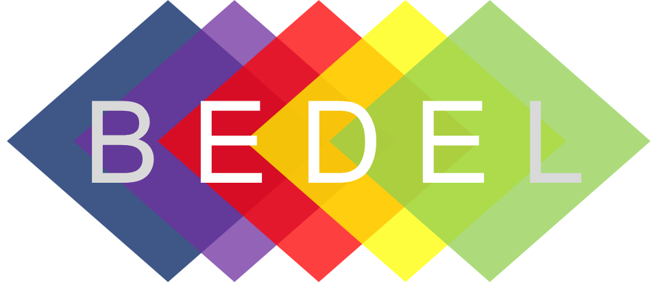

Probably the first proper JS app I wrote - kept around for historical purposes. Archived as will never have any further development.


# Bedel [](https://travis-ci.org/Gum-Joe/bedel) [](https://coveralls.io/github/Gum-Joe/bedel?branch=master) [](https://codeclimate.com/github/Gum-Joe/bedel) [](https://gitter.im/Gum-Joe/bedel?utm_source=badge&utm_medium=badge&utm_campaign=pr-badge&utm_content=badge)

Build, ship and manage apps, all from one dashboard.

# Getting started
### Before you get started, check you have the following:
- `node.js >= 6.0.0`
- `mongodb >= 2.0.0`

### As we are yet to tag our first release, clone this repo and run:
```bash
cd path/to/bedel
npm install
```
###### To start bedel:
```bash
bin/bedel
```
***Note:*** *You may need to add a username and password manually to you mongodb in the 'bedel' database. Please use [bcryptjs](https://github.com/dcodeIO/bcrypt.js) to hash the password with a salt factor of 10.*

# Tests
```bash
npm test
```

# License
The MIT License (MIT)

Copyright (c) 2016

Permission is hereby granted, free of charge, to any person obtaining a copy
of this software and associated documentation files (the "Software"), to deal
in the Software without restriction, including without limitation the rights
to use, copy, modify, merge, publish, distribute, sublicense, and/or sell
copies of the Software, and to permit persons to whom the Software is
furnished to do so, subject to the following conditions:

The above copyright notice and this permission notice shall be included in all
copies or substantial portions of the Software.

THE SOFTWARE IS PROVIDED "AS IS", WITHOUT WARRANTY OF ANY KIND, EXPRESS OR
IMPLIED, INCLUDING BUT NOT LIMITED TO THE WARRANTIES OF MERCHANTABILITY,
FITNESS FOR A PARTICULAR PURPOSE AND NONINFRINGEMENT. IN NO EVENT SHALL THE
AUTHORS OR COPYRIGHT HOLDERS BE LIABLE FOR ANY CLAIM, DAMAGES OR OTHER
LIABILITY, WHETHER IN AN ACTION OF CONTRACT, TORT OR OTHERWISE, ARISING FROM,
OUT OF OR IN CONNECTION WITH THE SOFTWARE OR THE USE OR OTHER DEALINGS IN THE
SOFTWARE.
